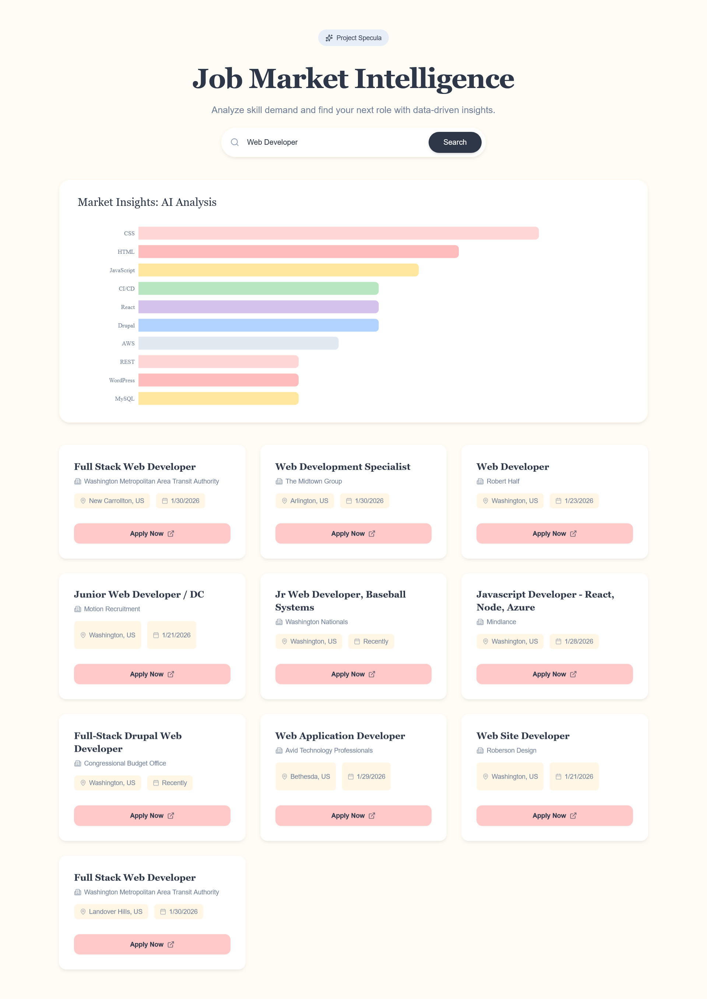

# Specula 👁️
> **Real-Time Job Market Intelligence & AI Analysis**



## Philosophy
**Specula** (Latin: *Watchtower*) is an intelligent tool designed to oversee the job market, identifying hidden patterns, rising skill demands, and salary trends that are not visible to the naked eye. Unlike traditional job boards, Specula focuses on **insights first**.

## Core Features

### AI-Powered Skill Extraction
Leverages **Google Gemini 2.x Flash** to dynamically analyze job descriptions in real-time. It reads the raw text of job postings to extract the top 10 "Hard Skills" (technologies, frameworks, languages) currently in demand for your search query.

### Design
A fully custom UI system built with **Tailwind CSS**. 
- **Warm Aesthetics**: Uses a cream & pastel palette to reduce eye strain and feel inviting.
- **Editorial Feel**: Serif typography (*Georgia*) mixed with clean Sans-Serif (*Inter*) for a modern digital magazine look.

### Smart & Efficient
- **Aggregated Search**: Integrates with JSearch (RapidAPI) to fetch jobs from LinkedIn, Indeed, Glassdoor, etc.
- **Intelligent Caching**: Minimizes API costs and reduces latency by caching search results for 24h and AI analysis for 1h.

---

## Tech Stack

### Client (Frontend)
- **Framework**: React (Vite)
- **Language**: TypeScript
- **Styling**: Tailwind CSS
- **State Management**: TanStack Query (React Query)
- **Visualization**: Recharts

### Server (Backend)
- **Framework**: FastAPI (Python)
- **AI Engine**: Google GenAI SDK (Gemini 2.5/2.0 Flash)
- **Validation**: Pydantic
- **Services**: Requests (API Client)

---

## Getting Started

### Prerequisites
- Node.js 18+
- Python 3.10+
- A Google Cloud API Key (for Gemini)
- A RapidAPI Key (for JSearch)

### Installation

1.  **Clone the repository**
    ```bash
    git clone https://github.com/doganibrahim/specula.git
    cd specula
    ```

2.  **Setup Backend**
    ```bash
    cd server
    # Create virtual env (optional but recommended)
    python -m venv venv
    # Install dependencies
    pip install -r requirements.txt
    ```
    Create a `.env` file in `server/`:
    ```env
    RAPIDAPI_KEY=your_jsearch_key
    GEMINI_API_KEY=your_google_ai_key
    ```
    Run the server:
    ```bash
    uvicorn main:app --reload
    ```

3.  **Setup Frontend**
    ```bash
    cd ../client
    npm install
    npm run dev
    ```

4.  **Explore**
    Open `http://localhost:5173` and search for your role!

---

## License
This project is open source and available under the MIT License.